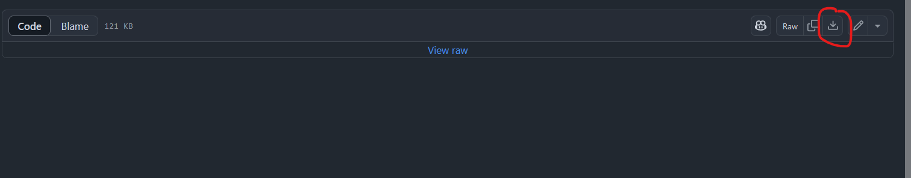
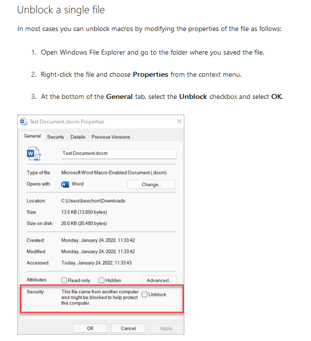

# ExSO.xlsm

ExSO.xlsm is a macro-enabled, excel-based GUI aiming to facilitate broader accessibility of the power system and market operation data supported by **ExSO**.

Being a macro-enabled excel file, some security concerns may be raised which are worth addressing in this memo:

- The source vba code is provided in a plain [text format](https://github.com/ThanosGkou/exso/tree/main/ExSO.xlsm/ExSO.xlsm.txt)
- **The only outgoing traffic in the vba code relates to downloading Python 3.13.0**
- The only console commands issued by ExSO.xlsm relate to:
  - Building a virtual environment 
  - Installing exso
  - Using the exso command-line interface through convenient clicks and ticks.
  
----

# Downloading ExSO.xlsm
In order to download the file, follow the file's [link](https://github.com/ThanosGkou/exso/tree/main/ExSO.xlsm/ExSO.xlsm), and hit the download button on the top-right corner:

----
# Unblocking ExSO.xlsm

- When downloading ExSO.xlsm in Windows, the file will (probably) come automatically blocked by Windows, and - generally speaking- rightfully so.
- in order to unblock the file:
  - Close the file (if opened)
  - right click > properties > Unblock
  - Reopen and use the file as intended.

----
# Using ExSO.xlsm
- Consult with the Documentation on [Installation](https://exso.readthedocs.io/en/latest/installation.html) and [Usage](https://exso.readthedocs.io/en/latest/api.html#exso-xlsm-api)

----
