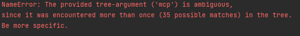
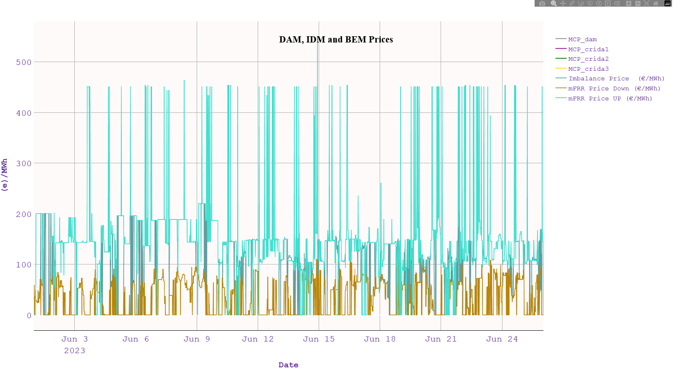

# ExSO
An analytical framework for the Greek and European Power&Gas, System Operation ("SO") & Market Exchange ("Ex").


-----
## <span style="color: #cdd613"> What is it? </span>
**ExSO** provides an integrated framework for retrieving, extracting, transforming, loading and analyzing time-aware data for the Greek and European Power&Gas sector.

It was developed as a private project, focusing on the Greek power & gas system. On the same architecture, support for Entso-e data was added, while more data-sources being planned for integration. 

([ENTSO-e's transparency platform](https://transparency.entsoe.eu/) was a game-changer on pan-european transparency. **ExSO**'s value to this end, consists of enabling automated updates, robust data storage, retrieval, transformations and visuals)

- The core of the project is the provision of an automated, versatile and robust framework for:
  - Downloading raw files ("the Datalake"), as reported by Power&Gas Publishing Entities (ENTSO-e, ADMIE/IPTO, HEnEX, Desfa, ...)
  - Compiling raw, sparse files into flat, clean, high-quality timeseries
  - Inserting/updating the parsed data to a local, self-maintained database ("the Database")
  - Providing an API for accessing, slicing, transforming, analyzing, and visualizing the local Database.


- The local database consists of a tree structure of local directories and .csv files. The reasons why we opted for csv-based format are aligned with the [Rationale](#rationale) of the project:
  - Anyone can access a csv file without needing programming or SQL skills (wider access)
  - No local/remote database server required (portability)
  - No significant loss of speed (good enough efficiency)

-----
## Rationale
**Publicly-available does not always mean publicly-accessible**
- Market players, TSOs, and professionals in the energy sector may or may not already have access to some of the data made accessible by **ExSO**, through paid or "members only" subscriptions (e.g. market participants).
- Individuals, researchers, and in (surprisingly) many cases professionals are either not entitled, or not willing to pay for high-quality data access.
- Even when an interested party is willing to pay for high-quality, long-term timeseries data, it's not clear where would he/she attend to.
- To our knowledge, no commercial or "members-only" database provides any of the variety, the duration, the reliability and the transparency that **exso** provides.
- We strongly believe in open access and transparency. **ExSO** is a project aiming to render publicly-available data in the scope of the Power&Gas sector, utilizable and accessible by anyone, expert or not.

-----
## Main Features

- Get **information** on implemented *Reports*, their content, their availability periods, metadatata, etc.
  - A *Report* is any set of properties, according to the way it's being published (e.g. Bulgarian Load @entsoe, ISP1ISPResults - Integrated Scheduling Process @admie, etc.)
- **Create** a local database of Market and System data (flat, seamless timeseries over the whole availability interval of each report)
- **Update** (hot/cold-start) the datalake and database for all or some of the implemented reports
- Interactive **Visualization**
- **Time-slicing** operations (timezone change, from/to time slicing)
- **Exporting/Extracting** visualizations and/or time-sliced data to a "sandbox" location (data in the database should not be modified in any way)

  ### <span style="color:  #cdd613 "> Implemented Reports  </span> 

  ([see more here](#implemented-reports))
  - As of version v1.0.0, there are:
    - 63 implemented reports for the greek power system & power exchange, and;
    - 5 types of Entso-e reports (Load, Generation per Type, Day-Ahead Prices, Exchange Schedule, Observed Flows) for almost all of the ENTSO-e listed countries


-----
# Datalake
The datalake consists of raw (.xls*, .csv, .zip) reports, as published by the publishing parties. 
- Each report is published (is available) over a specific date range (some reports may be no longer actively updated but still useful for historical analysis)
- Each report is published on a specific frequency (e.g. each day, each week, each month, etc.)
- Each report's content, spans over various horizons (e.g. one day-long, one week-long, one month-long, etc.)
- Each discrete report-file consists of one or more excel sheets
- Each report's data is expressed in a specific timezone (EET, UTC or CET) and may or may not have well-defined daylight-saving switches.

-----
# Datalake &rarr; Database

***exso*** performs:
- For each report (report-type)
  - Datalake Update (download raw excel files if there are newly published data) 
    - For each report file (i.e. for each date that this report was/is published)
      - For each report file excel-sheet
        - Data parsing, data cleaning, datetime conforming, disambiguation, joining
  - Database "upsert" (update / insert)


-----
# Database
The database, automatically created and maintained through the ***exso*** package, has a tree-like structure.

&rarr; **After the creation of the local database** ([update mode](#basic-update)), you can access it through the ***exso*** API.

- When the tree is initialized, it only retrieves the structure of the directories and files, and the column-names of each .csv file
- It does not read and load to memory the whole database. This can be done by the __call__ method of a Node object ([see Data Access section](#data-access))

### Database Tree Visualization
```sh
from exso import Tree
tree = Tree(root_base)

tree.make_tree()
# You can make a quick visualization of the directory structure and contents:
tree.visualize()
```


-----
### Datalake vs Database Comparison

#### Reports (aka report-names, or report-types)
- ***Report Names are almost always the same as the official report-names*** published by the publishing entities, and that's how they appear both in the datalake and in the database
- When using the "report"-kind to access some data, and having doubts on the correct names/strings to use, the name-to-use can be found:
  - in the [Implemented Reports](#implemented-reports)
  - By actually moving through the database directories (reports are directories)
  - Or by using the [Database Tree Visualization](#database-tree-visualization)
  - Or by accessing a "publisher"-kind Node-object's .children attributes
    ```sh
    publisher = Tree['root.some_publisher']
    reports = publisher.children
    ```

#### Excel Sheets / Fields
- Raw excel sheets may have peculiar naming conventions in the raw files.
- Excel ***sheet names are referred to as "fields" in the database-scope***, and may differ from the actual excel-sheet names of the raw datalake
- When using the "field"-kind to access some data (after the database creation/update), and having doubts on the correct names/strings, to use the name-to-use can be found in the actual database folder structure (Fields are directories in the database, NOT files).
  - You can do this by actually moving through the database directories
  - Or by using the [Database Tree Visualization](#database-tree-visualization)
  - Or by accessing a "report"-kind Node-object's .children attributes
    ```sh
    report = Tree['root.some_publisher.some_report']
    fields = report.children
    ```

#### Database files
- Because each raw excel **sheet** sometimes contains a lot of data that are sometimes heterogenonus:
  - Each raw excel sheet (corresponding to a database-field) is broken down in one or more "subfields", which are the actual final .csv files
  - When using the "file"-kind to access some data (after the database creation/update), and having doubts on the correct names/strings, the name-to-use can be found in the actual database folder structure ("Files" are .csv files in the database).
    - You can do this by actually moving through the database directories
    - Or by using the [Database Tree Visualization](#database-tree-visualization)
    - Or by accessing a "field"-kind Node-object's .children attributes
      ```sh
      field = Tree['root.some_publisher.some_report.some_field']
      files = field.children
      ```

#### Database Columns / Properties
- Each database file has one or more columns or "properties" (apart from the datetime column)
- When using the "property"-kind to access some data (after the database creation/update), and having doubts on the correct names/strings, the name-to-use can be found in the actual database folder structure ("Properties" are columns in the .csv files in the database).
  - You can do this by manually opening the database .csv files
  - **Not available** through the [Database Tree Visualization](#database-tree-visualization)
  - Or by accessing a "file"-kind Node-object's .children attributes
    ```sh
    file = Tree['root.some_publisher.some_report.some_field.some_file']
    properties = file.children
    ```   

-----
## Nodes
Each branch (a sub-tree) or leaf (an end-Node) of the Database Tree is a Node object. Each Node has specific [attributes](#node-attributes) (both in the literal, and in programming notion):
These attributes assist in accessing, manipulating, visualizing or exporting any combination of required system or market properties.

-----
### Node Attributes
The text below serves both a descriptive and a definitive purpose. (So, from now on, the term "kind" will have the meaning defined in this section)
- .name

  - a (descriptive) string. Sometimes, names are automatically given from the raw files, while other times there are some alterations. Names are generally non-unique accross the tree, but unique within the children of one node.
  
- .path 
  - physical path in the disk (directory or file)
  
- .dna
  - a concatenation of all the node's parents, dot-separated, and **case insensitive** (e.g. "root.henex.DaM_ReSuLtS")
  
- .kind
  - In the ***exso*** database, nodes can be of one of the 6 following kinds:
    - "root" (parent of all nodes)
    - "publisher" (parent of all reports, published by that publisher)
    - "report" (the name of the report, e.g. "ISP1ISPResults")
    - "field" (the name of the sheet of the original report-excel, e.g. ISP_Schedule. *with some exceptions)
    - "file" (a csv file containing some or all of the sheet (field)-data e.g. "Load")
    - "property" (a column of the csv file, e.g. "Net Load")
    
- .parent
- .children
- .siblings
- .ascendants
- .descendants
  - These are pretty much self-explanatory. They refer to Node objects, or Groups of Node objects (e.g. node.children returns a Group object, but can be accessed as a Node, e.g. node.children.dna, will return a list of dnas of that node's children)


-----
### Node Locators

Node Locators are unique Node identifications. Nodes can be uniquely accessed in more than one ways. The three main node locator types are:
- DNA locators
- Path locators
- Successive children locators

In all three cases, nodes are accessed through a succession chain:

- **root > publisher > reportName > fieldName > fileName** [>columnName]
  - root: Literally the database root, which is annotated simply as "root"
  - publisher: currently admie/henex
  - For reportName, fieldName, fileName, columnName, consult with sections 
  - 
  - reportName: 

For better demonstration, we'll use the example of ISP Activations/Redispatch, of a non-schedulued ISP (report_name = "AdhocISPResults"), only for Hydroelectric Units (see database visualization above)

The file is called **"Hydro.csv"** and is located in the directory **"root/admie/AdhocISPResults/ISP_Activations"**. All three methods below will return the desired Node object.


- #### DNA Locator

    ```sh
    tree['root.admie.adhocispresults.isp_activations.hydro'] # lower/upper case unimportant
    ```
  
- #### Path Locator
    ```sh
    tree["C:\path_to_root_database\admie\AdhocISPResults\ISP_Activations\Hydro.csv"] # exact path must be provided
    ```
  
- #### Successive children locators
    ```sh
    tree['root']['admie']['AdhocISPResults']['ISP_Activations']['Hydro'] # case sensitive: it accesses the names of the children of each successive node access
    ```
#### Locator Shortcuts...
- It's agood practice to access nodes with their **full dna chain**, because it will work every time. 
- That being said, and depending on the shortest unique part of the dna-chain, accross the database, shorter chains may also work.

   ```sh
   tree = exso.Tree()
   ```
- For example, **ALL of the below will work normally**, because there is only one entity in the whole database ***named*** "Imbalance Price  (€/MWh)" (whose .name attribute equals)
  ```sh
  # Full DNA: "root.admie.imbabe.imbabe.Imbalance Price  (€/MWh)"
  
  tree['root.admie.imbabe.imbabe.Imbalance Price  (€/MWh)'] # ok
  tree['admie.imbabe.imbabe.Imbalance Price  (€/MWh)']      # ok
  tree['imbabe.imbabe.Imbalance Price  (€/MWh)']            # ok
  tree['imbabe.Imbalance Price  (€/MWh)']                   # ok
  tree['Imbalance Price  (€/MWh)']                          # ok
  ```
  
- But, **NONE of the below will work:**
  ```sh
  # Full DNA: root.henex.dam_results.results.results.MCP
  
  tree['results.results.mcp']
  tree['results.mcp']
  tree['mcp']
  ```
  - These will raise an error:
   
    


```sh
# In this case, the acceptable (non-ambiguous) locators would be:

tree['root.henex.dam_results.results.results.MCP']
tree['henex.dam_results.results.results.MCP']
tree['dam_results.results.results.MCP']
```


-----
### Data Access

Data can be accessed, visualized, manipulated and extracted through Node operations. **(retrieve, export, plot)**

- Once a node has been called in any way (for export, for plot or just retrieval), the whole node is read and stored in memory.
- **Any timezone, or time-slicing operations, only affect the returned data.**
- The node's data remain intact and always in UTC timezone

#### Optional arguments (**kwargs) 
They are common accross all node-access operations, and they can modify the returned time-range (from/to), and the returned timezone.

- #####  tz_pipe 
  string, list, or None
  - If a string is provided:
    - The database data will first be localized as UTC, and then returned, converted to the specified timezone.
    - It can be combined with the "truncate_tz" argument, in order to first convert to desired timezone, but then truncate the trailing tz information
  - If a list is provided: [database_timezone, target_timezone, (None)]
  - The first argument specified the database-timezone, and **must always be UTC**
  - The second argument be any pytz compatible timezone: Try to stick to wider zones (EET, CET, UTC, GMT) and not country-wide timezones (e.g. Europe/Athens, etc.)
  - The third argument
    - **IF provided, must be None**. This means, to truncate the trailing timezone information (e.g. **2022-1-1 00:00+02:00 --> 2022-1-1 00:00**)
    - **IF not provided** (so, list is of length 2), the returned data will contain the tz-information.

- #####  truncate_tz
  bool (default = False)
  - It only has an effect if tz_pipe is a string
  - It truncates the trailing tz-information (e.g. 2023-1-1 00:00 **+03:00** will become 2023-1-1 00:00)

- #####  start_date,  end_date 
  string, pd.Timestamp, datetime-like, None
  - start_date = None means to start from the beginning of the file until end_date
  - end_date = None means to span from start_date  until the end of the file
  - string-format must be: YYYY-MM-DD HH:MM, as in all ***exso*** datetime occasions.
  


#### Usage

Retrieve a node's data:

  ```sh
  node_data = node() # data is actually read from the database files
      
  # retrieve data only for January '22, converted to EET timezone, and truncate the tz-information:
  # data is retrieved from memory
  node_data_range = node(tz_pipe = ['utc', 'eet', None], start_date = '2022-1-1', end_date = '2022-1-31')
  # or equivalently:
  node_data_range = node(tz_pipe = 'eet', start_date = '2022-1-1', end_date = '2022-1-31', truncate_tz = True)
  
  # the same, but this time, keep the tz-information
  node_data_range = node(tz_pipe = ['utc', 'eet'], start_date = '2022-1-1', end_date = '2022-1-31')
  # or, equivalently
  node_data_range = node(tz_pipe = 'eet', start_date = '2022-1-1', end_date = '2022-1-31')
  

  # retrieve all the node's data, in utc (data is retrieved from memory)
  node_data = node() # node's internal data not affected by an intermediate timezone/timeslicing operation.
  ```

    
      

Export a node's data:
  ```sh
  node.export(to_path, **kwargs)
  ```
    


Plot a node's data (node must be of file- or property-kind):
- Plotting whole files of considerable size (i.e. > 5-10 MB) may require considerable time

  ```sh
  node.plot() # this will plot the file timeseries in UTC over its whole span
      
  # example: stacked-area plot, in EET timezone, only for the period after 1st-Jan 2023. Also save the plot somewhere specified.

  node.plot(tz_pipe = 'eet', start_date = '2023-1-1', show = True, save_path = "C:/Users/Desktop/my_plot.html", area = True)
  ```
    


-----
#### Remarks

- The structure of the ***exso*** database, was built as a "one-size-fits-all" solution. This may work intuitively in information-rich reports, and less intuitively in very simple reports:
  ```sh
  # access sequence with DNA locators
  tree['root.<publisher>.<report_name>.<sheet/field>.<filename/subfield>]
  ```

      


- e.g. report = ISP1ISPResults
  - raw datalake file has **8 sheets**, and each sheet has **multiple subfields** (e.g. thermal dispatch, hydro dispatch, load, reserve requirements, a.o.)
  - in order to access e.g. thermal dispatch:
              
        tree['root.admie.isp1ispresults.isp_schedule.thermal] # - --> intuitive
  

- e.g. report = ISP1DayAheadLoadForecast
  - raw datalake file has a **single sheet**, with a **single subfield** (30-min Load Forecast)
  - in order to access it: 
  
        tree['root.admie.ISP1DayAheadLoadForecast.LoadForecast.LoadForecast'] # --> seems repetitive
- Fast-Forward operator:
  - The fast-forward operator will select the closest possible file, starting from the reference node.
  - In order to avoid string repetitions (where that's the case), the fast-forward operator '>>' can be used to fit the dna chain / locator, as such:

        tree['root.admie.isp1dayaheadloadforecast.>>'] # --> equivalent of ['root.admie.ISP1DayAheadLoadForecast.LoadForecast.LoadForecast']
  


-----

# Examples, Use-cases, Special Attention

## Database Nodes and NodesLocators
- Accessing nodes, transforming, and custom-exporting.
```sh
# Access a node:
isp1 = tree['root.admie.isp1ispresults'] # dict-like acess, dot separated, case INsensitive. --> the recommended usage

#Alternative methods
isp1 = tree.get_node(locator = 'root.admie.isp1ispresults') # get_node method accepts more than DNA locators
isp1 = tree.get_node(locator = 'path/to/database/admie/isp1ispresults')
isp1 = tree['root']['admie']['ISP1ISPResults']

# you can access a nodes' children
print(isp1.children)
# and get their dnas, names, paths
print(isp1.children.dna)
print(isp1.children.name)


isp1loadforecast_node = tree['root.admie.isp1ispresults.isp_schedule.load']

# Calling a node, returns the nodes' contents (dataframe, or dict (of dicts) of dataframes
isp1loadforecast_df = isp1loadforecast_node() # returns all available data in UTC timezone


## typical use-case: query some specific date range, convert it to a desired timezone and store it somewhere else, to send it to a colleague or do some excel graphs on it
isp1 = tree['root.admie.isp1ispresults'] # dot separated, case INsensitive

# export the whole data in utc timezone
isp1.export(to_path = "where/to/export/full_data_utc")
# export custom range in custom timezone, but first truncate the timezone attribute (+03:00 etc.)
isp1.export(to_path = "where/to/export/sliced_data_eet", tz_pipe = ['utc', 'eet', None], start_date = '2022-1-1 00:00', end_date = '2022-12-31 23:30')

# Note: the start_date:end_date filter is applied AFTER the timezone conversion (if given) 


# tz_pipe: timezone operations (see Data Access section)


## IMPORTANT:
# The optional arguments tz_pipe, start_date, end_date do not persist in memory!!
# This means that, the returned dataframe or dict of dataframe will have the requested charasteristics, but the node keeps its original information
# That is, if to be re-called without arguments, it will immediately return its raw content: UTC, tz-unaware, full available range

```
## Combine Nodes
The **.combine()** method of the exso.Tree, can be used to combined data on the node-level.
Advantage:
- Instead of being forced to call each node's data (frame), and then manually combine/transform them
- A virtual node is created, which has all the desired data, and all the Node objct's methods (plot, export, etc.)

```sh
tree = exso.Tree(root_base)

# a tuple or list of dnas as first, locational argument
combo = tree.combine(("henex.dam_results.results.results.mcp",
                      'henex.idm_crida1_results.results.results.mcp',
                      'henex.idm_crida2_results.results.results.mcp',
                      'henex.idm_crida3_results.results.results.mcp',
                      'admie.imbabe.imbabe.imbabe.Imbalance Price  (€/MWh)',
                      'mFRR Price Down (€/MWh)',
                      'mFRR Price Up (€/MWh)'),
                     with_name = "Market Prices", # the name of the virtual node
                     handle_synonymity = ['_dam','_crida1','_crida2','_crida3']))
                     
# handle_synonommity = 'auto' or a list of suffixes

combo.plot(tz_pipe = 'EET', start_date = '2023-6-1')

```



## Visualization
***exso*** utilizes the (extremely helpful and interactive) package [plotly](https://plotly.com/python) for data visualization.
The visualization of a Node object is as simple as calling its .plot() method:

Graphs can be zoomed in/out, rescaled, columns can be toggled-on/off in real time.

&rarr; By default, ***exso*** will **omit to plot any columns that are Zero or NaN** over the whole selected timerange, in order to make the plot lighter, both compuatationally and on the eyes.

```sh
isp1_thermal_gen = t['root.admie.isp1ispresults.isp_schedule.thermal']
fig = isp1_thermal_gen.plot(area = True, start_date = '2022-1-1', end_date = '2022-1-10', tz_pipe = 'EET', show = True, save_path = None)

# by default:  tz_pipe = 'EET', start_date = None, end_date = None,  area = False, show = True, save_path = Non

# the returned figure is of type "plotly.graph_objs._figure.Figure", meaning, you can set "show"=False, and update the layout with normal plotly usage before displaying it.
# Some very basic modification-options (title, x&y labels) will be supported directly through the exso.Node object
```


#### When calling the .plot() method of a Node:
- Any columns containing only NaN or only zero & nan values are **dropped**, in order to get a cleaner graph.
- The area = True/False argument, modifies whether the plot will be a stacked area, or a line plot
- start/end_dates, tz_pipe work exactly as in the __call__ method (node())
- show = True/False argument, controls whether to automatically display the graph when its rendered (in both cases, a figure object is returned)
- The save_path argument accepts a Path-like entry (.html), to locally save the graph (regardless of whether show=True/False)

---
## Disclaimers
- Any modification on the datalake and database structure, file and directory names, additions/deletions, will probably cause malfunctions.
- If you must open a database csv in-place (directly from the database directory, e.g. for quick inspection), which you shouldn't, you should at least not perform any saves (even if apparently, no changes were made)
- If you accidentally modify e.g. a database file, and the Updater malfunctions, you can manually delete the whole reports folder, and re-run the Updater.

---
## System Formats
By default, ***exso*** uses:
- "," (comma) for list separation 
- "." (dot) for decimal point

If your system settings are different, and don't want to change them, you can:

- Modify ***exso***'s default values just **once**
- Modify ***exso***'s default values **persistently** &rarr; recommended option

If your default/desired system formats do not comply with ***exso***'s defaults, these lines should be placed **before executing** any ***exso*** operations in order to work properly:

- IDE-based usage
  ```sh
  
  import exso
  # modify persistently
  exso._set_system_formats(decimal_sep = "your decimal separator", list_sep = "your list separator")
  
  # modify just once
  exso._list_sep = "your list separator"
  exso._decimal_sep = "you decimal point separator"

  
  ```
- CLI-based usage
  ```sh
  # modify persistently
  py -m exso set_system_formats --decimal_sep "your decimal separator" --list_sep "your list separator"
  
  # modify just once
  py -m exso <whatever command and config> --decimal_sep "your decimal separator" --list_sep "your list separator"
  ```
  
----
## Data Validation
The frequent changes in formats, reporting properties, periodic or one-time mislabeling, timezone ambiguity etc., may at some point result in a report being partially mis-parsed.
The Validation module of **exso** makes it easier to inspect and compare the raw datalake files to the database content.

The validation process creates and launches an excel-file, which conatains:
- The raw lake data, as they originally were
- The timeseries-data, on the same timzone that the raw data lake is
- The timeseries-data on UTC timezone (as they would be stored in the database)
```sh
from exso import Validation

# simplest setup validation (will validate only the first sheet of the raw datalake file)
report_names = 'ISP1ISPResults'
inspect_dates = '2022-2-19'
val = Validation(report_names=report_names, dates = inspect_dates, root_lake=root_lake, fields=None)
val.run()


# multi-val setup
report_name = 'ISP1ISPResults' # str
fields = ['ISP_Activations', 'CCGT_Schedule'] # str|list
inspect_dates = ['2022-2-19', '2022-2-20'] # datetime-like|list
val = Validation(report_name=report_name, dates = inspect_dates, root_lake=root_lake, fields=fields)
val.run()
```

----
## Features under active Development
### Data Documentation
Another aspect that creates difficulties in utilizing the published data (after one overcomes the sparsity of data), is the lack of detailed documentation per report, field, or property.
(e.g. The term "Net Load" may mean System Load minus pumping load, or Consumption minus RES, or Consumption minus RES minus pumping load, etc.)
At this stage, the Data Documentation provided in the ***exso*** package is far from perfect: Data Documentation is currently only on the report-level, providing high-level insights but not detailed disambiguations.

- A custom-made documentation, built as a light non-relational database is currently being developed and will be launched with one of the next versions of ***exso***.

### Analytics API
The current setup is oriented around *reports*. An Analytics API currently under development, will facilitate:
- Seaming properties from different reports of different timeframws (e.g. System Marginal Price to Market Clearing Price)
- Dedicated reporting and visualization (e.g. Daily System Snapshot of market prices, imports, loads, reserves, balancing, generation mix, etc.)
- Advanced analytics methods (e.g. Unit Unavailabilities statistics, comparisons, correlations)

### Support for more Reports
One of the following version, will contain some improvements on existing reports, and the addition of Water declaration and NTC reports.

Also, **ENTSO-E** will be added to the **supported publishers**, for across-europe data collection, integrated in the same local database.

### Support for Linux
Support for Linux-based systems is not foreseen at the moment, but feel free to submit a request if needed.

----
## Tests
- ***ExSO*** is fairly tested for the envisaged usage, but since the project is not (at least yet) intended for collaborative development, tests are not published.

- The design philosophy is not to catch all errors imagineable, but rather that basic users will stick to basic/documented usage, and that advanced users know what they're doing
- From the user's perspective, the [Validation module](#data-validation) is available to assist in validating/trusting that the database accurately reflects the raw datalaek files. 
----
## Issues
- Feel free to submit any issues [here](https://github.com/ThanosGkou/exso/issues) or via e-mail
- Use of ***ExSO*** (update mode) with conda environments, was reported to present encoding issues during printing coloured text in the console, and despite otherwise being functional, the print statement after each report's success causes an encoding error. Try to use pip environments instead.


----
## License

<a rel="license" href="http://creativecommons.org/licenses/by-nc-nd/4.0/"></a><br />This work is licensed under a <a rel="license" href="http://creativecommons.org/licenses/by-nc-nd/4.0/">Creative Commons Attribution-NonCommercial-NoDerivatives 4.0 International License (CC BY-NC-ND 4.0)</a>

Briefly (without this description being a substitute for the full license or any of its clauses):

**You are free to**:

- Use — Download/Install/Deploy ***exso***
- Share — copy and redistribute the material in any medium or format 


**Under the following terms**:
- Attribution — You must give appropriate credit, provide a link to the license, and indicate if changes were made. You may do so in any reasonable manner, but not in any way that suggests the licensor endorses you or your use. 
- NonCommercial — You may not use the material for commercial purposes. 
- NoDerivatives — If you remix, transform, or build upon the material, you may not distribute the modified material. 
- No additional restrictions — You may not apply legal terms or technological measures that legally restrict others from doing anything the license permits. 


----
## Citation
If ***ExSO*** assists you in making the "publicly available" data, actually valuable and accessible, consider citing:

#### APA

  - Natsikas, T. (2023). ExSO: Market Exchange and System Operation analytical framework (Version 1.0.0) [Computer software]. https://github.com/ThanosGkou/exso

#### BibTeX
- @software{Natsikas_ExSO_Market_Exchange_2023,
author = {Natsikas, Thanos},
month = apr,
title = {{ExSO: Market Exchange and System Operation analytical framework}},
url = {https://github.com/ThanosGkou/exso},
version = {1.0.0},
year = {2023}
}


----
