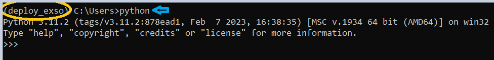
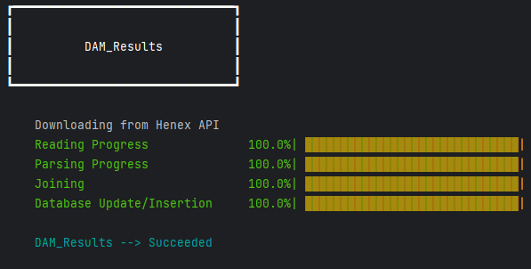
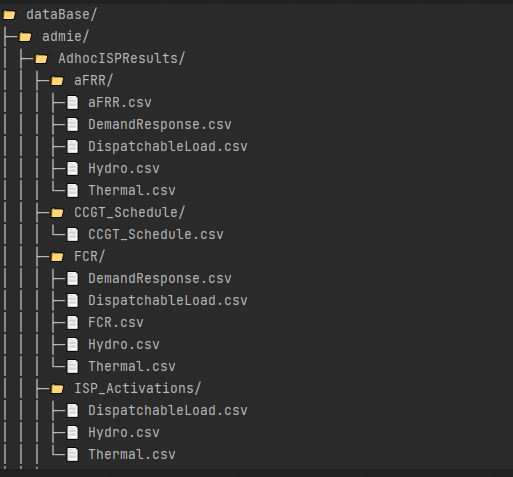
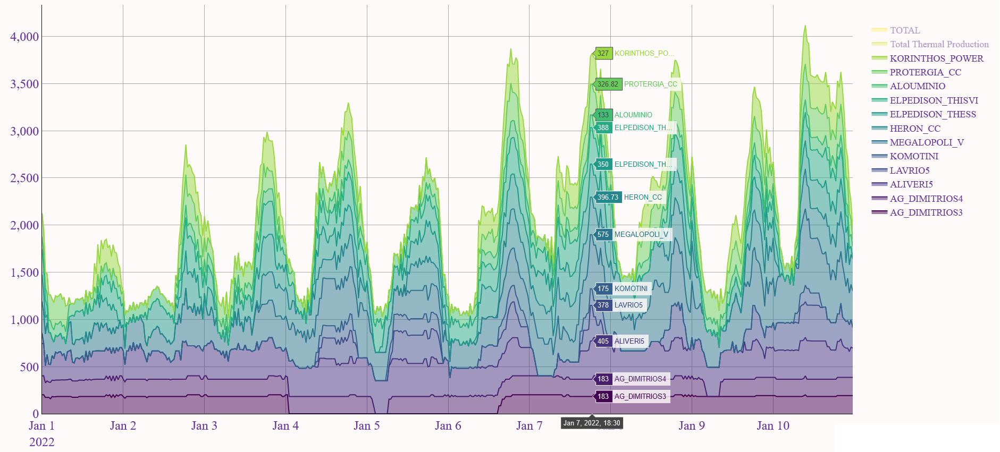

# Note
This is the README file of exso-0.0.0, included only to assist in cases, and for as long, the new [documentation](https://exso.readthedocs.io/en/latest/) is on the laconic side.

# ExSO
An analytical framework for the Greek Power&Gas System Operation ("SO") and Market Exchange ("Ex") Data.


-----
## <span style="color: #cdd613"> What is it? </span>
**exso** provides an integrated framework for retrieving, extracting, transforming, loading and analyzing timeseries data for the Greek Power&Gas sector.

- The core of the project is to provide an automated, versatile and robust framework for:
  - Downloading raw files ("the Datalake"), as reported by the Publishing Entities (ADMIE/IPTO, HEnEX, Desfa, ...)
  - Parsing/converting raw files to flat, clean, high-quality timeseries
  - Inserting/updating the parsed data to a local, self-maintained database ("the Database")
  - Providing an API for accecssing, slicing, transforming, analyzing, and visualizing the local Database.


- The local database consists of a tree structure of local directories and .csv files. The resons we opted for csv-based format are aligned with the [Rationale](#rationale) of the project:
  - Anyone can access a csv file without needing programming or SQL skills
  - No local/remote database server required
  - No significant loss of speed

-----
## Main Features

- Get **info** about implemented reports, their content, their availability periods, metadatata, etc.
- **Create** a local database of Market and System data (flat, seamless timeseries over the whole availability interval of each report)
- **Update** (hot/cold-start) the datalake and database for all or some of the implemented reports
- Interactive **Visualization**
- **Time-slicing** operations (timezone change, from/to time slicing)
- **Exporting/Extracting** visualizations and/or time-sliced data to a "sandbox" location (data in the database should not be modified in any way)

  ### <span style="color:  #cdd613 "> Implemented Reports  </span> 

  ([see more here](#implemented-reports))


|  id | Report Name                          |  id | Report Name                          |  id | Report Name                          | id | Report Name                          |
|----:|:-------------------------------------|----:|:-------------------------------------|----:|:-------------------------------------|---:|:-------------------------------------|
|   1 | AdhocISPResults                      |  21 | IDM_CRIDA2_AggDemandSupplyCurves     |  41 | ISP1DayAheadRESForecast              |  61| SystemRealizationSCADA               |
|   2 | BalancingCapacityProduct             |  22 | IDM_CRIDA2_MarketCoupling            |  42 | ISP1ISPResults                       |
|   3 | BalancingEnergyProduct               |  23 | IDM_CRIDA2_Results                   |  43 | ISP1Requirements                     |
|   4 | DAM_AggDemandSupplyCurves            |  24 | IDM_CRIDA2_ResultsSummary            |  44 | ISP1UnitAvailabilities               |
|   5 | DAM_BlockOrders                      |  25 | IDM_CRIDA3_AggDemandSupplyCurves     |  45 | ISP2DayAheadLoadForecast             |
|   6 | DAM_GasVTP                           |  26 | IDM_CRIDA3_MarketCoupling            |  46 | ISP2DayAheadRESForecast              |
|   7 | DAM_MarketCoupling                   |  27 | IDM_CRIDA3_Results                   |  47 | ISP2ISPResults                       |
|   8 | DAM_PhysicalDeliveriesOfftakes       |  28 | IDM_CRIDA3_ResultsSummary            |  48 | ISP2Requirements                     |
|   9 | DAM_PreMarketSummary                 |  29 | IDM_LIDA1_AggDemandSupplyCurves      |  49 | ISP2UnitAvailabilities               |
|  10 | DAM_Results                          |  30 | IDM_LIDA1_Results                    |  50 | ISP3IntraDayLoadForecast             |
|  11 | DAM_ResultsSummary                   |  31 | IDM_LIDA1_ResultsSummary             |  51 | ISP3IntraDayRESForecast              |
|  12 | DayAheadLoadForecast                 |  32 | IDM_LIDA2_AggDemandSupplyCurves      |  52 | ISP3ISPResults                       |
|  13 | DayAheadRESForecast                  |  33 | IDM_LIDA2_Results                    |  53 | ISP3Requirements                     |
|  14 | DAS                                  |  34 | IDM_LIDA2_ResultsSummary             |  54 | ISP3UnitAvailabilities               |
|  15 | DayAheadSchedulingUnitAvailabilities |  35 | IDM_LIDA3_AggDemandSupplyCurves      |  55 | LTPTRsNominationsSummary             |
|  16 | HVCUSTCONS                           |  36 | IDM_LIDA3_Results                    |  56 | RealTimeSCADARES                     |
|  17 | IDM_CRIDA1_AggDemandSupplyCurves     |  37 | IDM_LIDA3_ResultsSummary             |  57 | RealTimeSCADASystemLoad              |
|  18 | IDM_CRIDA1_MarketCoupling            |  38 | IDM_XBID_Results                     |  58 | ReservoirFillingRate                 |
|  19 | IDM_CRIDA1_Results                   |  39 | IMBABE                               |  59 | RESMV                                |
|  20 | IDM_CRIDA1_ResultsSummary            |  40 | ISP1DayAheadLoadForecast             |  60 | RESMVLVPROD                          |


-----
## Rationale
**Publicly-available does not always mean publicly-accessible** 
- Market players, TSOs, and professionals in the energy sector may or may not already have access to some of the data made accessible by **exso**, through paid or "mebers only" subscriptions (e.g. market participants).
- Individuals, researchers, and in (surprisingly) many cases professionals are either not entitled, or not willing to pay for high-quality data access.
- Even when an interested party is willing to pay for high-quality, long-term timeseries data, it's not clear where would he/she attend to.
- To our knowledge, no commercial or "members-only" database provides any of the variety, the duration, the reliability and the transparency that **exso** provides. 
- We strongly believe in open access and transparency. **ExSO** is a project aiming to render publicly-available data in the scope of the Greek Power&Gas sector, utilizable and accessible by anyone, expert or not.


-----
## Installation

Required Python Version >=3.10
```sh
pip install exso
```

- Note: If you are connected through your company's access point, and your company has restrictions against [PyPI](https://pypi.org/) and/or [GitHub](https://github.com/), you may be unable to install, not just ***exso*** but any open-source python package.
### For non-programmers
- Regardless of whether you have another Python installation in your PC or not, go ahead and install the [latest Python version](https://www.python.org/ftp/python/3.11.3/python-3.11.3-amd64.exe). Opt-in for the "Add Python to PATH" option during installation pop-up.
    - ***exso*** is tested for Python >=3.10. Any previous version (<=3.9) will most likely be partially or fully incompatible.
  

- After installation is complete, **open a windows terminal** (In windows search, type "cmd" and hit enter)


- **Create a virtual environment** ([more on virtual environments (venvs) and how they work](https://docs.python.org/3/library/venv.html#how-venvs-work))
  - First, locate which python versions are installed by typing (in the command-line terminal):

    ```sh
    py -0
    ```
           
  - Take note of the latest version (let's assume it is 3.11), and type:
    ```sh
    py -3.11 -m venv "C:\Users\yourUserNameHere\exso_venv"
    
    # (Hit Enter) Now the vitrtual environment is created.
    ```
        
        
      
- #### Activate the Virtual Environment
    ```sh
    # (replace yourUserNameHere with your actual windows username, and hit enter)
    "C:\Users\yourUserNameHere\exso_venv\Scripts\activate.bat"
    ```
      
      
    

- Install the ***exso*** package by typing (in the **same command line session**)
  ```sh
  pip install exso
  ```

-----
# ***exso*** API
 ***exso*** can be used either through the **command line interface** ("CLI-based" for short), intended for only the core usage, **or** as an importable **python package** through any IDE ("IDE-based" for short), intended and allowing more advanced usage.
- At the moment, the CLI-based API has some namespace inconsistencies compared to the IDE-based API
  - e.g. set_system_formats instead of _modify_system_formats(...), a.o.
- They can only become annoying if frequently switching from CLI-based to IDE-based usage, which is not really probable, but they will nonetheless be conformed by the next ***exso*** version.

### For non-programmers
* Both the CLI-based and the IDE-based usages are fairly straight-forward
* For Command-Line interface, see the [CLI documentation](#command-line-interface-cli)
* For IDE-based usage:
  * Either install a proper IDE (e.g. [Pycharm Community](https://www.jetbrains.com/pycharm/download/download-thanks.html?platform=windows&code=PCC) is an excellent IDE but there's some learning curve involved), OR 
  * Use the python-interface:
    * Open a command-line terminal and [Activate the exso virtual environment](#activate-the-virtual-environment)
    * Then, simply write "python" and hit enter
      
    * Now, follow the [IDE-based usage documentation](#ide-based-usage)
  

* It is **critical** that you read the [System Formats](#system-formats) section before you get going.
* If you plan to use the exso API also for querying/time-slicing/visualizing data, you should read the documentation on [Database](#database), [Nodes](#nodes), and the [examples snippets](#examples-use-cases-special-attention)


-----
### Command Line Interface (CLI)

Open a windows terminal, and [activate the exso virtual environment](#activate-the-virtual-environment)
- List available reports and text descriptions (available in the sense of ***exso***-available, not necessarily already present in datalake/database)

  ```sh
  py -m exso info
  ```
       
- Set system formats:
  ```sh
  # Recommended: The below stand-alone command, permanently informs exso on your system format settings, and does not require to 
  #              be explicitly specified again
  
  py -m exso set_system_formats --decimal_sep "your decimal separator" --list_sep "your list separator"
  # Otherwise, you can still specify the --decimal_sep and/or --list_sep arguments, but if the mode argument is not "set_system_formats",
  # the modification will be valid just for this run of exso, and will revert to default values afterwards.
  ```
       
       
       

- Database & Datalake update (or first-time setup)
  - **IMPORTANT:** Whenever an argument refers to a path (e.g. path/to/whatever), this should better be placed **inside double quotes** to ensure smooth operation (avoid issues with empty spaces in paths).
  ```sh
  py -m exso update -rl path/to/root/datalake -rb path/to/root/database # or...
  py -m exso update -rl path/to/root/datalake -rb path/to/root/database --which ReportName1 ReportName2 ReportName3
  ```

          
  
  - You can find the full path to your specified directories by clicking on the address bar of windows explorer

    


- Extraction / Timezone Conversion / Timeslicing / Visualizing (See section [Node Locators](#node-locators))
  ```sh
  py -m exso query -rb path/to/root/database -loc NodeLocator -output_dir path/to/some/dir -tz desiredTimezone -from YYYY-MM-DD -until YYYY-MM-DD -extract -plot -stacked
  ```

- **Hint**: To avoid too much copy-pasting, the default values for root-lake and root-base are ".\datalake" and ".\database"
  - This means, that (after having activated the virtual environment), if you navigate to a desired directory, you can launch the command line without specifying the -rl and -rb arguments
  ```sh
  # Activate venv (indicative name of venv = "deploy_exso")
  C:\Users\theUser>Desktop\VENVs\PythonVENVs\deploy_exso\Scripts\activate.bat
  
  # Navigate to desired directory, that will host / is already hosting both the datalake and the database
  (deploy_exso) C:\Users\theUser>cd Desktop\exso_data
  
  # you can now launch exso without specifying root-lake and/or root-base paths
  (deploy_exso) C:\Users\theUser\Desktop\exso_data>py -m exso update
  ```
  
- 

  #### Notes on CLI arguments
  - **<span style="color: #2fb2b6"> -rl</span>**: path to the (desired or existing) root datalake directory
  - **<span style="color: #2fb2b6"> -rb</span>**: path to the (desired or existing) root databake directory
  - **<span style="color: #2fb2b6"> --which</span>**: if the positional argument is **update**, you can optionally enter only specific report names to update (space separated, case-sensitive, as they are listed in the [Implemented Reports](#implemented-reports) section)
  - the <span style="color: #2fb2b6"> **-extract** </span> argument, if passed, must be accompanied by the -output_dir argument
  - the <span style="color: #2fb2b6"> **-plot** </span> argument is valid only if the node corresponding to the given NodeLocator is a file or property node (not a directory)
  - the <span style="color: #2fb2b6"> **-stacked** </span> argument makes the plot (if given) a stacked-area plot
  - the <span style="co[exso_CLI.doc](src%2Fexso_CLI.doc)lor: #2fb2b6"> **-tz** </span> argument is optional.  If given, it will convert the database data (which is in UTC) to the specified timezone (including daylight-saving shifts) 
    - Recommendation: Don't enter country-specific timezone names. Prefer broader timezones (e.g. EET, CET, UTC, etc.).
  - the <span style="color: #2fb2b6"> **-from** </span> argument is optional (can be combined with -until): format "YYYY-MM-DD HH:MM"
  - the <span style="color: #2fb2b6"> **-until** </span> argument is optional (can be combined with -from): format "YYYY-MM-DD HH:MM"

  #### CLI formal documentation

  ```sh
  py -m exso --help
  ```

  ```sh
  usage: py -m exso [-h] [-rl ROOT_LAKE] [-rb ROOT_BASE] [--which WHICH [WHICH ...]] [--val_report VAL_REPORT] [--val_dates VAL_DATES [VAL_DATES ...]] [--val_fields VAL_FIELDS [VAL_FIELDS ...]] [-loc QUERY_LOCATOR]
          [-output_dir QUERY_OUTPUT_DIR] [-tz QUERY_TZ] [-from QUERY_FROM] [-until QUERY_UNTIL] [-extract] [-plot] [-stacked] [--decimal_sep DECIMAL_SEP] [--list_sep LIST_SEP]
          {info,update,validate,query,set_system_formats}

  positional arguments:
    {info,update,validate,query,set_system_formats}

  options:
    -h, --help            show this help message and exit
    -rl ROOT_LAKE, --root_lake ROOT_LAKE
    -rb ROOT_BASE, --root_base ROOT_BASE
    --which WHICH [WHICH ...]
                          --which argument can be either 'all' (default), or a list of valid report-names (space-separated)
    --val_report VAL_REPORT
                          report name you wish to validate.
    --val_dates VAL_DATES [VAL_DATES ...]
                          space separated date(s) to validate. format: YYYY-M-D
    --val_fields VAL_FIELDS [VAL_FIELDS ...]
                          "Field(s)" are the filenames, as to be found in the database folder of a specific report (space separated).
    -loc QUERY_LOCATOR, --query_locator QUERY_LOCATOR
                          'locator' means a unique identifier of database objects. example: root.admie.isp1ispresults, will extract the whole database of this report and transform it / slice it depending on the rest of the options you
                          set.
    -output_dir QUERY_OUTPUT_DIR, --query_output_dir QUERY_OUTPUT_DIR
                          If specified, it will be used to save the generated plot (if -plot), and/or the extracted timeslice (if -extract).
    -tz QUERY_TZ, --query_tz QUERY_TZ
    -from QUERY_FROM, --query_from QUERY_FROM
                          Start date(time) of query (YYYY-M-D [H:M])
    -until QUERY_UNTIL, --query_until QUERY_UNTIL
                          End date(time) of query (YYYY-M-D [H:M])
    -extract, --query_extract
                          If added, it means you wish to EXTRACT the specified query (among possible other actions)
    -plot, --query_plot   If added, it means you wish to PLOT the upstream query (among possible other actions)
    -stacked, --plot_stacked
                          If added, it means you wish the PLOT specified, to be a stacked-area plot
    --decimal_sep DECIMAL_SEP
    --list_sep LIST_SEP
  
  ```
          

-----
# IDE-based Usage

## Basic update
The below script will download and insert to the database all (61) currently supported reports. For more information continue reading.

```sh
from exso import Updater
# define where you want the datalake and the database to be stored in the disk
root_lake = r"path\to\desired\datalake\directory" # e.g. r"C:\Users\your_username\exsodata\datalake"
root_base = r"path\to\desired\database\directory" # e.g. r"C:\Users\your_username\exsodata\database"


# root_lake and root_base can also be pathlib.Path objects
upd = Updater(root_lake, root_base, all=True)
upd.run()

```
#### Update Progress
Progress bars will be displayed for every kind of operation for each report, as demonstrated in the figure below, for e.g. report = DAM_Results:



#### Performance & System Requirements

A **full cold-start** process of all 61 reports, might take from **2 to over 5 hours**, depending on internet speed, processing power, memory and non-***exso*** PC usage. Indicative time requirements:

- Pentium-tier processors + 4GB RAM --> ~6 hours (not a good idea in general)
- 8th-gen high-performance i5 processor + 16GB --> 2.5 hours
- 12th-gen high-performance i7 processor + 16GB --> 1.5 hours

After the first database update (creation actually), each **daily or weekly update** process takes a matter of **a few minutes**.

***exso*** is not optimized for performance (and probably won't be anytime soon):

- Publishing parties keep on changing formats, contents, adding/removing report sections, modifying string representations, etc. 
- This requires very "low-level" (in variable level, not machine-level) control over reading, parsing, datetime-indexing in order to work for all reports
- Frankly performance is not essential: 
  - The blow is taken once, at the database initialization: Daily, weekly, monthly updates are really a matter of minutes.
  - The database querying speeds are fast (speed in data operations is always refering to a specific context). The computational cost lies in parsing the datalake files.

The combined Database & Datalake takes up approximately **4GB of disk space**

-----
## Implemented Reports
***exso*** currently supports a total of 61 reports from ADMIE/IPTO and HEnEx. Some of them are obsolete (but still useful for analytics), and some ongoing.

In order to review the available reports or decide which ones fit your needs and update only those, a Report.Pool object can be useful.
```sh
from exso import Report

# Instantiate a report Pool object
rp = Report.Pool()
description = rp.get_text_description() # returns a dictionary of available reports. e.g. {report_name1: report1_description, report_name2: report2_description}

# to get the description of a specific report, you can print:
report_name = "select a valid report name"
print(description[report_name])

# The .get_available() method, returns dataframe with available reports, and their basic metadata
# To get only a list of names, set only_names <- False
metadata = rp.get_available(only_names = False)

```
.png)


-----
## Custom Update
```sh
# Now, if you conclude that you want e.g. 3 specific reports (at least for now), you can:
interesting_reports = ['reportname1', 'reportname2', 'reportname3']
upd = Updater(root_lake, root_base, reports_pool = rp,  some = interesting_reports) # given that you have already instantiated a Report.Pool object

# or, for future use
upd = Updater(root_lake, root_base, some = interesting_reports) # with no need of instantiating a Report.Pool object

# Very often, a specific datalake-file (excel file) for a given date, may have multiple versions. (e.g. YYYYMMDD_report_01.xlsx, YYYYMMDD_report_02.xlsx)
# The use_lake_version argument allows to select which version to use.
# By default it is set to 'latest'.  Other options: 'first' or any natural number
upd.run(use_lake_version = 'latest')

# The below query, will use datalake-files whose version is 4, given that the file actually has 4 or more versions.
# If the specific file has only two versions, then version 2 will be used.
# The integer lake version is interpreted as: "Use this version, or the most recent version available prior to it"
upd.run(use_lake_version = 4)
```
-----
# Datalake
The datalake consists of raw excel (.xls, or .xlsx, or .zip of .xls*) reports, as published by the publishing parties. 
- Each report is published (is available) over a specific date range (some reports may be no longer actively updated but still useful for historical analysis)
- Each report is published on a specific frequency (e.g. each day, each week, each month, etc.)
- Each report file content, spans over various horizons (e.g. one day-long, one week-long, one month-long, etc.)
- Each report file consists of one or more excel sheets
- Each report is expressed in a specific timezone (EET, UTC or CET) and may or may not have well-defined daylight-saving switches.

-----
# Datalake &rarr; Database

***exso*** performs:
- For each report (report-type)
  - Datalake Update (download raw excel files if there are newly published data) 
    - For each report file (i.e. for each date that this report was/is published)
      - For each report file excel-sheet
        - Data parsing, data cleaning, datetime conforming, disambiguation, joining
  - Database "upsert" (update / insert)


-----
# Database
The database, automatically created and maintained through the ***exso*** package, has a tree-like structure.

&rarr; **After the creation of the local database** ([update mode](#basic-update)), you can access it through the ***exso*** API.

- When the tree is initialized, it only retrieves the structure of the directories and files, and the column-names of each .csv file
- It does not read and load to memory the whole database. This can be done by the __call__ method of a Node object ([see Data Access section](#data-access))

### Database Tree Visualization
```sh
from exso import Tree
tree = Tree(root_base)

tree.make_tree()
# You can make a quick visualization of the directory structure and contents:
tree.visualize()
```


-----
### Datalake vs Database Comparison

#### Reports (aka report-names, or report-types)
- ***Report Names are almost always the same as the official report-names*** published by the publishing entities, and that's how they appear both in the datalake and in the database
- When using the "report"-kind to access some data, and having doubts on the correct names/strings to use, the name-to-use can be found:
  - in the [Implemented Reports](#implemented-reports)
  - By actually moving through the database directories (reports are directories)
  - Or by using the [Database Tree Visualization](#database-tree-visualization)
  - Or by accessing a "publisher"-kind Node-object's .children attributes
    ```sh
    publisher = Tree['root.some_publisher']
    reports = publisher.children
    ```

#### Excel Sheets / Fields
- Raw excel sheets may have peculiar naming conventions in the raw files.
- Excel ***sheet names are referred to as "fields" in the database-scope***, and may differ from the actual excel-sheet names of the raw datalake
- When using the "field"-kind to access some data (after the database creation/update), and having doubts on the correct names/strings, to use the name-to-use can be found in the actual database folder structure (Fields are directories in the database, NOT files).
  - You can do this by actually moving through the database directories
  - Or by using the [Database Tree Visualization](#database-tree-visualization)
  - Or by accessing a "report"-kind Node-object's .children attributes
    ```sh
    report = Tree['root.some_publisher.some_report']
    fields = report.children
    ```

#### Database files
- Because each raw excel **sheet** sometimes contains a lot of data that are sometimes heterogenonus:
  - Each raw excel sheet (corresponding to a database-field) is broken down in one or more "subfields", which are the actual final .csv files
  - When using the "file"-kind to access some data (after the database creation/update), and having doubts on the correct names/strings, the name-to-use can be found in the actual database folder structure ("Files" are .csv files in the database).
    - You can do this by actually moving through the database directories
    - Or by using the [Database Tree Visualization](#database-tree-visualization)
    - Or by accessing a "field"-kind Node-object's .children attributes
      ```sh
      field = Tree['root.some_publisher.some_report.some_field']
      files = field.children
      ```

#### Database Columns / Properties
- Each database file has one or more columns or "properties" (apart from the datetime column)
- When using the "property"-kind to access some data (after the database creation/update), and having doubts on the correct names/strings, the name-to-use can be found in the actual database folder structure ("Properties" are columns in the .csv files in the database).
  - You can do this by manually opening the database .csv files
  - **Not available** through the [Database Tree Visualization](#database-tree-visualization)
  - Or by accessing a "file"-kind Node-object's .children attributes
    ```sh
    file = Tree['root.some_publisher.some_report.some_field.some_file']
    properties = file.children
    ```   

-----
## Nodes
Each branch (a sub-tree) or leaf (an end-Node) of the Database Tree is a Node object. Each Node has specific [attributes](#node-attributes) (both in the literal, and in programming notion):
These attributes assist in accessing, manipulating, visualizing or exporting any combination of required system or market properties.

-----
### Node Attributes
The text below serves both a descriptive and a definitive purpose. (So, from now on, the term "kind" will have the meaning defined in this section)
- .name

  - a (descriptive) string. Sometimes, names are automatically given from the raw files, while other times there are some alterations. Names are generally non-unique accross the tree, but unique within the children of one node.
  
- .path 
  - physical path in the disk (directory or file)
  
- .dna
  - a concatenation of all the node's parents, dot-separated, and **case insensitive** (e.g. "root.henex.DaM_ReSuLtS")
  
- .kind
  - In the ***exso*** database, nodes can be of one of the 6 following kinds:
    - "root" (parent of all nodes)
    - "publisher" (parent of all reports, published by that publisher)
    - "report" (the name of the report, e.g. "ISP1ISPResults")
    - "field" (the name of the sheet of the original report-excel, e.g. ISP_Schedule. *with some exceptions)
    - "file" (a csv file containing some or all of the sheet (field)-data e.g. "Load")
    - "property" (a column of the csv file, e.g. "Net Load")
    
- .parent
- .children
- .siblings
- .ascendants
- .descendants
  - These are pretty much self-explanatory. They refer to Node objects, or Groups of Node objects (e.g. node.children returns a Group object, but can be accessed as a Node, e.g. node.children.dna, will return a list of dnas of that node's children)


-----
### Node Locators

Node Locators are unique Node identifications. Nodes can be uniquely accessed in more than one ways. The three main node locator types are:
- DNA locators
- Path locators
- Successive children locators

In all three cases, nodes are accessed through a succession chain:

- **root > publisher > reportName > fieldName > fileName** [>columnName]
  - root: Literally the database root, which is annotated simply as "root"
  - publisher: currently admie/henex
  - For reportName, fieldName, fileName, columnName, consult with sections 
  - 
  - reportName: 

For better demonstration, we'll use the example of ISP Activations/Redispatch, of a non-schedulued ISP (report_name = "AdhocISPResults"), only for Hydroelectric Units (see database visualization above)

The file is called **"Hydro.csv"** and is located in the directory **"root/admie/AdhocISPResults/ISP_Activations"**. All three methods below will return the desired Node object.


- #### DNA Locator

    ```sh
    tree['root.admie.adhocispresults.isp_activations.hydro'] # lower/upper case unimportant
    ```
  
- #### Path Locator
    ```sh
    tree["C:\path_to_root_database\admie\AdhocISPResults\ISP_Activations\Hydro.csv"] # exact path must be provided
    ```
  
- #### Successive children locators
    ```sh
    tree['root']['admie']['AdhocISPResults']['ISP_Activations']['Hydro'] # case sensitive: it accesses the names of the children of each successive node access
    ```

  


-----
### Data Access

Data can be accessed, visualized, manipulated and extracted through Node operations. **(retrieve, export, plot)**

- Once a node has been called in any way (for export, for plot or just retrieval), the whole node is read and stored in memory.
- **Any timezone, or time-slicing operations, only affect the returned data.**
- The node's data remain intact and always in UTC timezone

Optional arguments (**kwargs) are common for all three operations, and they can modify the returned time-range (from/to), and the returned timezone.
- tz_pipe: None or list
  - If a list is provided: [database_timezone, target_timezone, (None)]
  - The databases timezone is UTC and shall be set to UTC
  - The target_timezone can be any pytz compatible timezone: Try to stick to wider zones (EET, CET, UTC, GMT) and not country-wide timezones (e.g. Europe/Athens, etc.)
  - Last argument: 
    - If is None, this means, after tz-conversion, truncate the timezone information (e.g. 2022-1-1 00:00 +02:00 will become --> 2022-1-1 00:00)
    - If it doesn't exist (e.g. the list is [database_tz, target_Tz], the returned data will contain the tz-information) 

- start_date / end_date: it can accept pandas Timestamps and datetime.datetime objects, but also strings formatted as YYYY-MM-DD HH:MM


#### Usage

Retrieve a node's data:

  ```sh
  node_data = node() # data is actually read from the database files
      
  # retrieve data only for January '22, converted to EET timezone:
  # data is retrieved from memory
  node_data_range = node(tz_pipe = ['utc', 'eet', None], start_date = '2022-1-1', end_date = '2022-1-31')

  # retrieve all the node's data, in utc (data is retrieved from memory)
  node_data = node() # node's internal data not affected by an intermediate timezone/timeslicing operation.
  ```

    
      

Export a node's data:
  ```sh
  node.export(to_path, **kwargs)
  ```
    


Plot a node's data (node must be of file- or property-kind):
- Plotting whole files of considerable size (i.e. > 5-10 MB) may require considerable time

  ```sh
  node.plot() # this will plot the file timeseries in UTC over its whole span
      
  # example: stacked-area plot, in EET timezone, only for the period after 1st-Jan 2023. Also save the plot somewhere specified.

  node.plot(tz_pipe = ['utc', 'eet', None], start_date = '2023-1-1', show = True, save_path = "C:/Users/Desktop/my_plot.html", area = True)
  ```
    


-----
#### Remarks

- The structure of the ***exso*** database, was built as a "one-size-fits-all" solution. This may work intuitively in information-rich reports, and less intuitively in very simple reports:
  ```sh
  # access sequence with DNA locators
  tree['root.<publisher>.<report_name>.<sheet/field>.<filename/subfield>]
  ```

      


- e.g. report = ISP1ISPResults
  - raw datalake file has **8 sheets**, and each sheet has **multiple subfields** (e.g. thermal dispatch, hydro dispatch, load, reserve requirements, a.o.)
  - in order to access e.g. thermal dispatch: tree['root.admie.isp1ispresults.isp_schedule.thermal]
  - --> intuitive


- e.g. report = ISP1DayAheadLoadForecast
  - raw datalake file has a **single sheet**, with a **single subfield** (30-min Load Forecast)
  - in order to access it: tree['root.admie.ISP1DayAheadLoadForecast.LoadForecast.LoadForecast']
  - --> seems repetitive, but that's how it is.


-----

# Examples, Use-cases, Special Attention

## Database Nodes and NodesLocators
- Accessing nodes, transforming, and custom-exporting.
```sh
# Access a node:
isp1 = tree['root.admie.isp1ispresults'] # dict-like acess, dot separated, case INsensitive. --> the recommended usage

#Alternative methods
isp1 = tree.get_node(locator = 'root.admie.isp1ispresults') # get_node method accepts more than DNA locators
isp1 = tree.get_node(locator = 'path/to/database/admie/isp1ispresults')
isp1 = tree['root']['admie']['ISP1ISPResults']

# you can access a nodes' children
print(isp1.children)
# and get their dnas, names, paths
print(isp1.children.dna)
print(isp1.children.name)


isp1loadforecast_node = tree['root.admie.isp1ispresults.isp_schedule.load']

# Calling a node, returns the nodes' contents (dataframe, or dict (of dicts) of dataframes
isp1loadforecast_df = isp1loadforecast_node() # returns all available data in UTC timezone


## typical use-case: query some specific date range, convert it to a desired timezone and store it somewhere else, to send it to a colleague or do some excel graphs on it
isp1 = tree['root.admie.isp1ispresults'] # dot separated, case INsensitive

# export the whole data in utc timezone
isp1.export(to_path = "where/to/export/full_data_utc")
# export custom range in custom timezone
isp1.export(to_path = "where/to/export/sliced_data_eet", tz_pipe = ['utc', 'eet', None], start_date = '2022-1-1 00:00', end_date = '2022-12-31 23:30')

# Note: the start_date:end_date filter is applied AFTER the timezone conversion (if given) 


# tz_pipe: a list of timezone operations

#The first argument must ALWAYS be UTC (that's the timezone that the csv files are initially on)
##e.g. 01/01/2021 00:00 will become 01/01/2021 00:00+00:00

#The second argument (optional) is a timezone to convert the data to. (e.g. EET)
##e.g. 01/01/2021 00:00+00:00 will become: 2021-01-01 02:00+02:00

#The third argument (optional) can only be None, if provided. It means, truncate the timezone information from the converted data 
##e.g. 2021-01-01 02:00+02:00 will become: 2021-01-01 02:00


## IMPORTANT:
# The optional arguments tz_pipe, start_date, end_date do not persist in memory!!
# This means that, the returned dataframe or dict of dataframe will have the requested charasteristics, but the node keeps its original information
# That is, if to be re-called without arguments, it will immediately return its raw content: UTC, tz-unaware, full available range

```

## Visualization
***exso*** utilizes the (extremely helpful and interactive) package [plotly](https://plotly.com/python) for data visualization.
The visualization of a Node object is as simple as calling its .plot() method:

Graphs can be zoomed in/out, rescaled, columns can be toggled-on/off in real time.

&rarr; By default, ***exso*** will **omit to plot any columns that are Zero or NaN** over the whole selected timerange, in order to nake the plot lighter.

```sh
isp1_thermal_gen = t['root.admie.isp1ispresults.isp_schedule.thermal']
fig = isp1_thermal_gen.plot(area = True, start_date = '2022-1-1', end_date = '2022-1-10', tz_pipe = ['UTC', 'EET', None], show = True, save_path = None)

# the returned figure is of type "plotly.graph_objs._figure.Figure", meaning, you can set "show"=False, and update the layout with normal plotly usage before displaying it.
# Some very basic modification-options (title, x&y labels) will be supported directly through the exso.Node object
```


#### When calling the .plot() method of a Node:
- Any columns containing only NaN or only zero & nan values are **dropped**, in order to get a cleaner graph.
- The area = True/False argument, modifies whether the plot will be a stacked area, or a line plot
- start/end_dates, tz_pipe work exactly as in the __call__ method (node())
- show = True/False argument, controls whether to automatically display the graph when its rendered (in both cases, a figure object is returned)
- The save_path argument accepts a Path-like entry (.html), to locally save the graph (regardless of whether show=True/False)

## Disclaimers
- Any modification on the datalake and database structure, file and directory names, additions/deletions, will probably cause malfunctions.
- If you must open a database csv in-place (directly from the database directory, e.g. for quick inspection), which you shouldn't, you should at least not perform any saves (even if apparently, no changes were made)
- If you accidentally modify e.g. a database file, and the Updater malfunctions, you can manually delete the whole reports folder, and re-run the Updater.

## System Formats
By default, ***exso*** uses:
- "," (comma) for list separation 
- "." (dot) for decimal point

If your system settings are different, and don't want to change them, you can:

- Modify ***exso***'s default values just **once**
- Modify ***exso***'s default values **persistently** &rarr; recommended option

If your default/desired system formats do not comply with ***exso***'s defaults, these lines should be placed **before executing** any ***exso*** operations in order to work properly:

- IDE-based usage
  ```sh
  
  import exso
  # modify persistently
  exso._modify_system_formats(decimal_sep = "your decimal separator", list_sep = "your list separator")
  
  # modify just once
  exso._list_sep = "your list separator"
  exso._decimal_sep = "you decimal point separator"

  
  ```
- CLI-based usage
  ```sh
  # modify persistently
  py -m exso set_system_formats --decimal_sep "your decimal separator" --list_sep "your list separator"
  
  # modify just once
  py -m exso <whatever command and config> --decimal_sep "your decimal separator" --list_sep "your list separator"
  ```
  
----
## Data Validation
The frequent changes in formats, reporting properties, periodic or one-time mislabeling, timezone ambiguity etc., may at some point result in a report being partially mis-parsed.
The Validation module of **exso** makes it easier to inspect and compare the raw datalake files to the database content.

The validation process creates and launches an excel-file, which conatains:
- The raw lake data, as they originally were
- The timeseries-data, on the same timzone that the raw data lake is
- The timeseries-data on UTC timezone (as they would be stored in the database)
```sh
from exso import Validation

# simplest setup validation (will validate only the first sheet of the raw datalake file)
report_names = 'ISP1ISPResults'
inspect_dates = '2022-2-19'
val = Validation(report_names=report_names, dates = inspect_dates, root_lake=root_lake, fields=None)
val.run()


# multi-val setup
report_name = 'ISP1ISPResults' # str
fields = ['ISP_Activations', 'CCGT_Schedule'] # str|list
inspect_dates = ['2022-2-19', '2022-2-20'] # datetime-like|list
val = Validation(report_name=report_name, dates = inspect_dates, root_lake=root_lake, fields=fields)
val.run()
```

----
## Features under active Development
### Data Documentation
Another aspect that creates difficulties in utilizing the published data (after one overcomes the sparsity of data), is the lack of detailed documentation per report, field, or property.
(e.g. The term "Net Load" may mean System Load minus pumping load, or Consumption minus RES, or Consumption minus RES minus pumping load, etc.)
At this stage, the Data Documentation provided in the ***exso*** package is far from perfect: Data Documentation is currently only on the report-level, providing high-level insights but not detailed disambiguations.

- A custom-made documentation, built as a light non-relational database is currently being developed and will be launched with one of the next versions of ***exso***.

### Analytics API
The current setup is oriented around *reports*. An Analytics API currently under development, will facilitate:
- Seaming properties from different reports of different timeframws (e.g. System Marginal Price to Market Clearing Price)
- Dedicated reporting and visualization (e.g. Daily System Snapshot of market prices, imports, loads, reserves, balancing, generation mix, etc.)
- Advanced analytics methods (e.g. Unit Unavailabilities statistics, comparisons, correlations)

### Support for more Reports
The next version, will contain some improvements on existing reports, and the addition of Water declaration and NTC reports.

### Support for Linux
Support for Linux-based systems is not foreseen at the moment, but feel free to submit a request if needed.

----
## Tests
- ***ExSO*** is fairly tested for the envisaged usage, but since the project is not (at least yet) intended for collaborative development, tests are not published.
- The design philosophy is not to catch all errors imagineable, but rather that basic users will stick to basic/documented usage, and that advanced users know what they're doing
  - e.g. attempting to plot a file beyond its available datetime range, will not
- From the user's perspective, the [Validation module](#data-validation) is available to assist in validating/trusting that the database accurately reflects the raw datalaek files. 
----
## Issues
- Feel free to submit any issues [here](https://github.com/ThanosGkou/exso/issues) or via e-mail


----
## License

<a rel="license" href="http://creativecommons.org/licenses/by-nc-nd/4.0/"></a><br />This work is licensed under a <a rel="license" href="http://creativecommons.org/licenses/by-nc-nd/4.0/">Creative Commons Attribution-NonCommercial-NoDerivatives 4.0 International License (CC BY-NC-ND 4.0)</a>

Briefly (without this description being a substitute for the full license or any of its clauses):

**You are free to**:

- Use — Download/Install/Deploy ***exso***
- Share — copy and redistribute the material in any medium or format 


**Under the following terms**:
- Attribution — You must give appropriate credit, provide a link to the license, and indicate if changes were made. You may do so in any reasonable manner, but not in any way that suggests the licensor endorses you or your use. 
- NonCommercial — You may not use the material for commercial purposes. 
- NoDerivatives — If you remix, transform, or build upon the material, you may not distribute the modified material. 
- No additional restrictions — You may not apply legal terms or technological measures that legally restrict others from doing anything the license permits. 


----
## Citation
If **exso** assists you in making the "publicly available" data, actually valuable and accessible, consider citing:

#### APA

  - Natsikas, T. (2023). ExSO: market Exchange and Sytem Operation analytical framework (Version 0.0.0) [Computer software]. https://github.com/ThanosGkou/exso

#### BibTeX
- @software{Natsikas_ExSO_market_Exchange_2023,
author = {Natsikas, Thanos},
month = apr,
title = {{ExSO: market Exchange and Sytem Operation analytical framework}},
url = {https://github.com/ThanosGkou/exso},
version = {0.0.0},
year = {2023}
}


----
