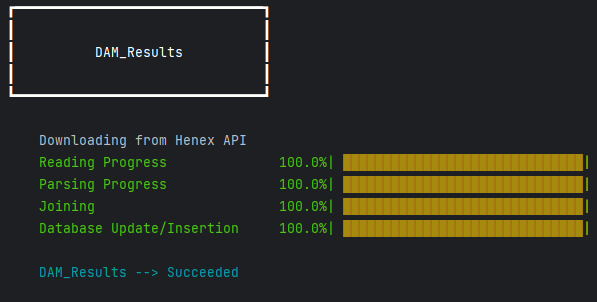
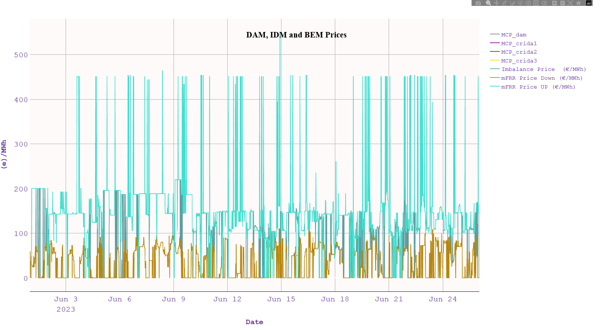
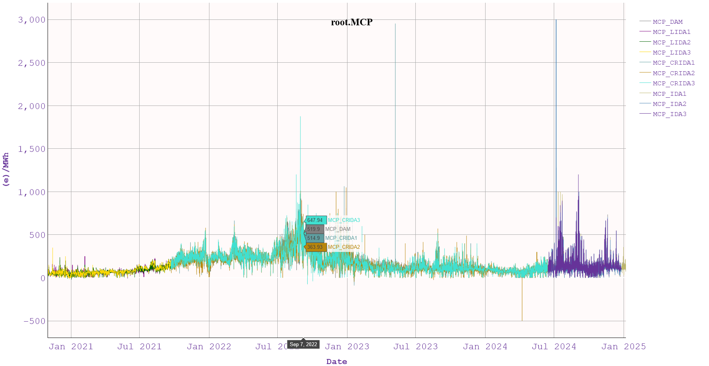
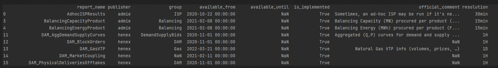
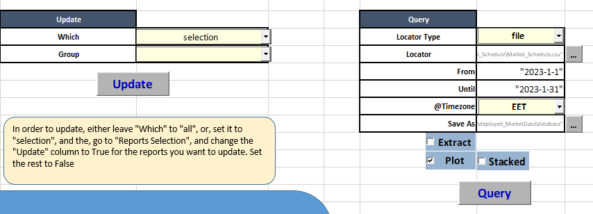

.. _api:

API
===

.. include:: substitutions.rst

.. _python_api:
Python API
"""""""""""

.. _ssf_api:
exso._set_system_formats method
---------------------------------
:code:`exso._set_system_formats(list_sep=',', decimals_sep = '.')`

exso.Updater class
------------------
The class for performing datalake/database updates.

::

    exso.Updater(root_lake:str|Path|None=None,
                 root_base:str|Path|None=None,
                 which:str|list|None = None,
                 exclude:str|list|None=None,
                 groups:str|list|None = None,
                 publishers:str|list|None = None)

    # param root_lake: [str|Path|None] The desired path to use as the datalake directory
    #   If None, default path for windows is: C:\Users\<username>\Desktop\exso_data\datalake
    # param root_base: [str|Path|None] the desired path to use as the database directory
    #   If None, default path for windows is: C:\Users\<username>\Desktop\exso_data\database

    # param which (optional): If given, will update only these report name(s) *
    # param exclude (optional): If given, will NOT update these report groups *
    # param publishers (optional): If given, will update only reports of this/these publishers *
    # param groups (optional): If given, will update only these report group(s) *

* **The Parameters: which, exclude, groups, publishers are intersectional filters.**

::

    # Example
    import exso
    root_lake = r"path\to\desired\datalake\directory" # e.g. r"C:\Users\your_username\exsodata\datalake"
    root_base = r"path\to\desired\database\directory" # e.g. r"C:\Users\your_username\exsodata\database"

    upd = exso.Updater(root_lake, root_base)
    upd.run()

    # progress bar per-report will be shown in console

exso.Tree class
------------------
The class for locating specific nodes from the database (and more).

* Docs on what are :ref:`Locators and how to use them <node_locators>`

::

    tree = exso.Tree(root_path:Path|str|None)

Tree.combine
------------
Allows for combining multiple nodes to a single node. Applies only for 'file'-kind Nodes

::

    synthetic_node = tree.combine(*locators,
                                   with_name:str|None = None,
                                   handle_synonymity:str|list = 'auto',
                                   resolution = 'auto'))

    # param *locators: a list|tuple of the node locators you want to combine (locator1, locator2, ..., locatorN). Locators must be of the kind 'file'
    # param with_name: the name of the new synthetic node.
    # param handle_synonymity: when combining nodes, it's possible to end up with naming conflicts (property1 of locator1 having the same name as propertyN of locatorM).
        # if 'auto', and if such conflict emerges, the returned node will have properties with suffixes (prop_locator1, prop_locatorN)
        # Else, you can provide a list of suffixes to be applied for each locator, which will only be applied if such conflict arises
    # param resolution: How to handle nodes with different datetime resolutions. Not really suggested to put anything other than 'auto'

::

    # example for combining MCPs across all markets historically
    t = exso.Tree(root_base)

    # Since all properties are named "MCP", we provide a custom list to handle this synonymity
    mcps = t.combine(('dam_results.results.buy.mcp',
                      'idm_lida1_results.results.buy.mcp',
                      'idm_lida2_results.results.buy.mcp',
                      'idm_lida3_results.results.buy.mcp',
                      'idm_crida1_results.results.buy.mcp',
                      'idm_crida2_results.results.buy.mcp',
                      'idm_crida3_results.results.buy.mcp',
                      'idm_ida1_results.results.buy.mcp',
                      'idm_ida2_results.results.buy.mcp',
                      'idm_ida3_results.results.buy.mcp',
                      ),
                     with_name="MCP",
                     handle_synonymity=['_DAM', '_LIDA1', '_LIDA2', '_LIDA3',
                                        '_CRIDA1', '_CRIDA2', '_CRIDA3',
                                        '_IDA1','_IDA2', '_IDA3'])
    mcps.plot(tz = 'EET', kind=  'line', ylabel='(e)/MWh', title="MCP Across Markets",)

Tree.visualize
---------------
Displays a visual representation of the database structure

::

    tree.visualize()

.. figure:: figs/database_Viz.png
   :scale: 50 %

Tree.__getitem__
-----------------
The main method to access nodes of the database through node-locators. Checkout Locators and how to use them :ref:`here <node_locators>`

::

    node = tree[locator]

    # e.g.
    node = tree['root.henex.dam_results.dam_results.results']

    # or:
    node = tree['dam_results.>>']

exso.Node class
-----------------

::

    # First, instantiate a tree and a node

    tree = exso.Tree("path/to/database")
    node = tree["d.n.a.of.node"]

All node methods used for retrieving/exporting/visualizing data use a common set of slicing parameters::

        node(start_date, end_data, tz, truncate_tz, **call_kwargs)
        node.plot(start_date, end_data, tz, truncate_tz, **plot_kwargs)
        node.export(start_date, end_data, tz, truncate_tz, **export_kwargs)

        # Common Arguments
        param start_date: str|None
            Format: 'YYYY-MM-DD' ['HH:MM']
            if given, the retrieved data will be given from that date(time) onwards
            The start_date will be perceived to the timezone given (or, if no timezone is given, to UTC)
        param end_date: str|None
            Format: 'YYYY-MM-DD' ['HH:MM']
            if given, the retrieved data will be given until that date(time).
            Can be combines with start_date
            The end_date will be perceived to the timezone given (or, if no timezone is given, to UTC)
        tz: str|None
            usual options: ['eet', 'utc', 'cet'], but any valid timezone can be given
            If given, the retrieved data will be converted/localized to the given timezone
            If given, the start_date and/or end_date will be perceived to refer to the timezone given.
                e.g. if start_date = '2024-01-01 00:00', and tz = 'EET', it is assumed that the start_date given refers to the timezone-converted data.

These common arguments will be referred to as: **common_kwargs in the sections below

:code:`Node.__call__()`
------------------------

* Calling a node will return its contents as a pd.DataFrame, or dict (of dicts) of pd.DataFrames depending on the node's :code:`.kind`, after applying the provided **kwargs.
* Any call to a node does not incur changes to the underlying node's data, nor the database files.

::
    # return a file-node's data starting from 01-Jan-2025, in UTC
    df = node(start_date = '2025-1-1)

    # return a report's whole data for all available period, in EET
    dict_of_dicts_of_dataframes = node(tz = 'EET')

.. _node_plot_api:

:code:`Node.plot()`
--------------------
::

    node.plot(**common_kwargs,
              kind='area',
              show = True,
              save_path = None,
              title = None, ylabel = None, xlabel = None,
              df = None,
              line_cols = None, area_cols = None,
              transformation = None) --> plotly.Figure

    kind: options = ['area', 'line']
        Indicates whether to do a staacked-area plot or a line plot

    show: bool
        Indicates whether to show the plot or just plot and return it/save it.

    save_path: Path|str|None
        If given, saves the plot to this path.
        Can be given either the desired filepath (ending in .html), or a desired directory

    title, ylabel, xlabel: self-explanatory

    df: pd.DataFrame|None
        If given, then the given dataframe will be plotted instead of the node where the .plot method was called from

    line_cols, area_cols: specify columns to plot as line plots, and columns to plot as area plots in a combo-chart.
        This is in beta stage and may not work very well currently

    transformation: func|None
        If a function is given, it must def func(df:pd.DataFrame): --> pd.DataFrame
            If given, this function will be applied AFTER performing the slicing with start_date, end_date, tz to the data in hand
            df = transformation(df)

    The node.plot() method returns a plotly Figure object, which you can further transform on your own.

:code:`Node.export()`
----------------------
This method allows to export and transform data from the database to another location for further custom processing.
It can be applied not only to files but to any kind of node (even to the whole database)
::

    node.export(to_path: str|Path,
                **common_kwargs)

    to_path: str|Path
        it can be a filepath or a directory path, existing or non-existing
        If the node to export is a directory (not a file) but to_path is a filepath, an error will occur

Node Attributes
-----------------
The text below serves both a descriptive and a definitive purpose.
So, from now on, the term "kind" will have the meaning defined in this section

* .name

  * a (descriptive) string. Sometimes, names are automatically given from the raw files, while other times there are some alterations. Names are generally non-unique accross the tree, but unique within the children of one node.

* .path

  * physical path in the disk (directory or file)

* .dna

  * a concatenation of all the node's parents, dot-separated, and **case insensitive** (e.g. "root.henex.DaM_ReSuLtS")

* .kind

  * In the ***exso*** database, nodes can be of one of the 6 following kinds:
    - "root" (parent of all nodes)
    - "publisher" (parent of all reports, published by that publisher)
    - "report" (the name of the report, e.g. "ISP1ISPResults")
    - "field" (the name of the sheet of the original report-excel, e.g. ISP_Schedule. *with some exceptions)
    - "file" (a csv file containing some or all of the sheet (field)-data e.g. "Load")
    - "property" (a column of the csv file, e.g. "Net Load")

* .parent, .children, .siblings, .ascendants, .descendants
    Pretty much self-explanatory. They refer to Node objects, or Groups of Node objects (e.g. node.children returns a Group object, but can be accessed as a Node, e.g. node.children.dna, will return a list of dnas of that node's children)

Report Object
--------------
In order to review the available reports or decide which ones fit your needs and update only those, a Report.Pool object can be useful::

    from exso import Report

    # Instantiate a report Pool object
    rp = Report.Pool()
    description = rp.get_text_description() # returns a dictionary of available reports. e.g. {report_name1: report1_description, report_name2: report2_description}

    # to get the description of a specific report
    report_name = "select a valid report name"
    print(description[report_name])

    # The .get_available() method, returns dataframe with available reports, and their basic metadata
    # To get only a list of names, set only_names <- False
    metadata = rp.get_available(only_names = False)

.. _cli_api:
Command Line API
""""""""""""""""""
In order to use exso through the command line:

* Launch a terminal and activate the virtual environment where exso is installed
* Use the Command-Line API options:

>>> (venv) python -m exso [--args]

- Example for update mode:
>>> (venv) python -m exso update -rl "path/to/datalake" -rb "path/to/database" --which ISP1ISPResults

- Default database and datalake locations are:
    - datalake: Desktop/exso_data/datalake
    - database: Desktop/exso_data/database

Below lies the list with all options for the command-line api of exso, which is accessible through:

>>> (venv) python -m exso --help

::

    positional arguments:
      {info,update,validate,query,set_system_formats}

    options:
      -h, --help            show this help message and exit
      -rl, --root_lake ROOT_LAKE
      -rb, --root_base ROOT_BASE
      --which WHICH [WHICH ...]
                            --which argument can be either 'all' (default), or a list of valid report-names (space-separated)
      --exclude EXCLUDE [EXCLUDE ...]
                            specify report name(s) to exclude from the update process
      --publishers {admie,henex,entsoe} [{admie,henex,entsoe}]

      --groups
      -loc, --query_locator QUERY_LOCATOR
                            'locator' means a unique identifier of database objects. example: root.admie.isp1ispresults, will extract the whole database of this report and transform it / slice it
                            depending on the rest of the options you set.
      -output_dir, --query_output_dir QUERY_OUTPUT_DIR
                            If specified, it will be used to save the generated plot (if -plot), and/or the extracted timeslice (if -extract).

      -tz, --query_tz QUERY_TZ

      -from, --query_from QUERY_FROM
                            Start date(time) of query (YYYY-M-D [H:M])
      -until, --query_until QUERY_UNTIL
                            End date(time) of query (YYYY-M-D [H:M])
      -extract, --query_extract
                            If added, it means you wish to EXTRACT the specified query (among possible other actions)
      -plot, --query_plot   If added, it means you wish to PLOT the upstream query (among possible other actions)
      -stacked, --plot_stacked
                            If added, it means you wish the PLOT specified, to be a stacked-area plot
      --decimal_sep DECIMAL_SEP
      --list_sep LIST_SEP

.. _xlsm_api:
ExSO.xlsm API
""""""""""""""

As of version 1.0.1, you can use exso through an excel-based gui |xlsm|, for basic exso-functionality:

* You can :ref:`Download and Install exso directly from ExSO.xlsm <install_with_xlsm>`
* You can specify the reports to update in the "Reports Selection" Sheet.
* Launch an update or query through buttons and option boxes

* ExSO.xlsm will only work for Python 3.13 !!
    * If you don't have python 3.13 installed, hit the "Download Python" Button
    * If you already have python 3.13 installed, just hit "Install ExSO"
        * If you have a current installation of python 3.13, but forgot to hit the "Add Python to PATH" during installation, you will probably need to uninstall and re-install (or search how to add PYTHON to PATH online)
    * By hitting "install ExSO", a new virtual environment will be created here:  "C:/Users/yourusername/AppData/Local/exso/venv3.13"
    * If the exact virtual environment already exists, the process will fail. You will need to delete it manually and then relaunch.

