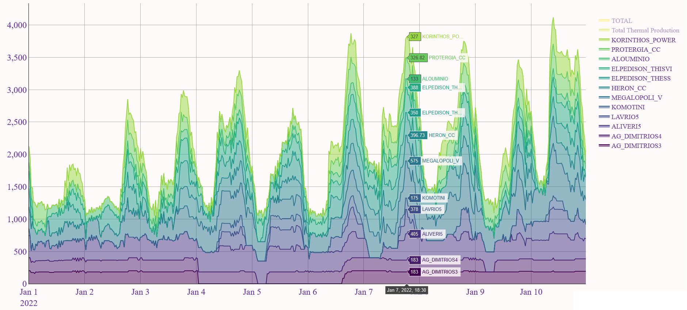
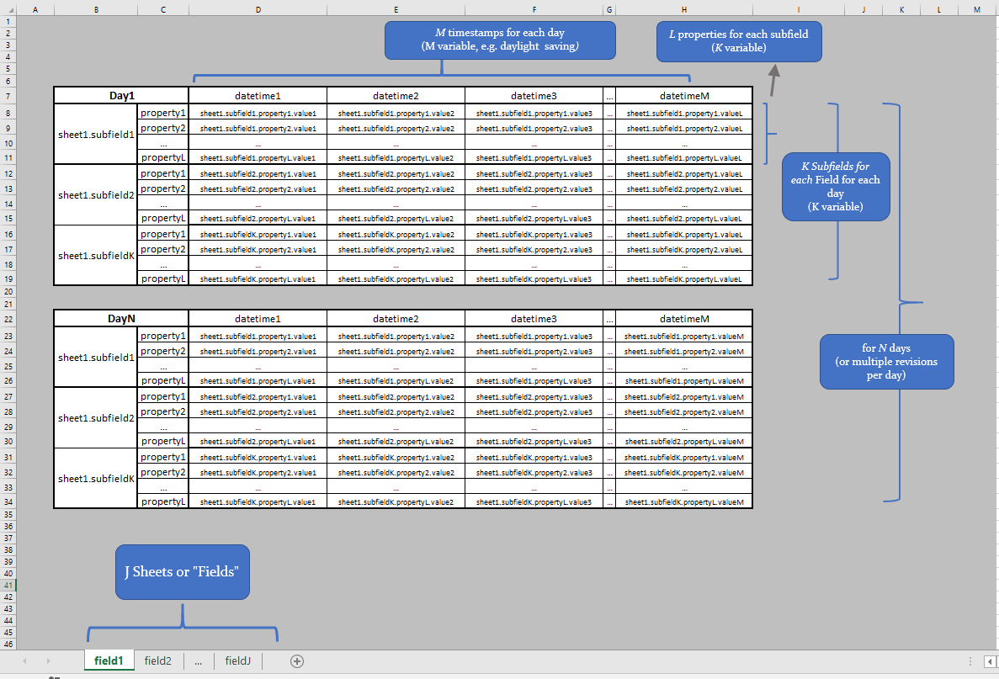
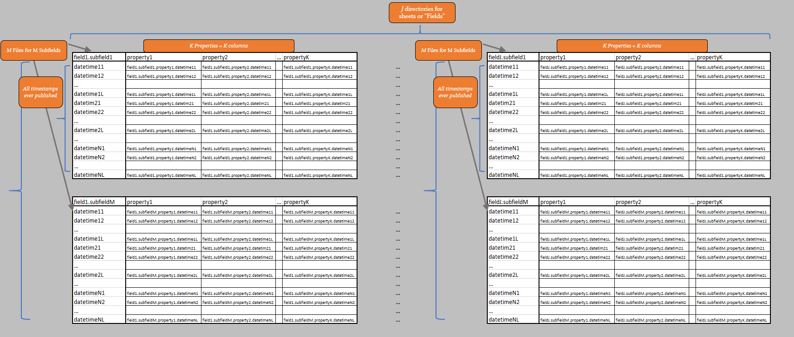

.. _core_concepts:
Core Concepts
"""""""""""""""

.. include:: substitutions.rst

ExSO is a robust framework that aimed at enhancing data-transparency for the greek power market and system operation. The core functionalities include:

* Capability to build and maintain a local (csv-based) database for the greek system ("update" mode)
.. figure:: figs/database_Viz.png
   :scale: 50 %

* Access, combine, transform, visualize, extract data from the database ("query" mode)

There are three potentially complementary ways of using ExSO:

* Through :ref:`ExSO.xlsm <xlsm_api>`
* Through an :ref:`IDE <python_api>`
* Through the :ref:`command line <cli_api>`

**This section summarizes the core concepts of exso, relevant for all three interaction apis**

Report
-------
* A report (or report type) is a category of files, for a specific system or market operation.
* For each report type, report files are published on a corresponding frequency (daily, weekly, annually, ad-hoc)
* Report Files may be excel or text files containing data for the specific report type, for a specific time period
    * In case of excel files, they may contain several Sheets.

Publisher
----------
* Publishers are the entities that publish the Reports. They may include AMIDE (IPTO), HEnEx, ENTSO-e, DESFA, etc.

Datalake
---------
* The datalake is a local directory created by **exso**, containing all report files as downloaded from the publishers
* The general structure is: :menuselection:`root --> Publisher --> ReportName --> Raw Report Files`
* The general structure of each Report File is: :menuselection:`file --> sheets (fields) --> subfields --> properties`

The datalake consists of raw excel (.xls, or .xlsx, or .zip of .xls*) reports, as published by the publishing parties.

* Each report is published (is available) over a specific date range (some reports may be no longer actively updated but still useful for historical analysis)
* Each report is published on a specific frequency (e.g. each day, each week, each month, etc.)
* Each report file content, spans over various horizons (e.g. one day-long, one week-long, one month-long, etc.)
* Each report file consists of one or more excel sheets
* Each report is expressed in a specific timezone (EET, UTC or CET) and may or may not have well-defined daylight-saving switches.

Database
---------
* The database is a local directory created by **exso**, containing a high-quality, continuous version of the raw report files
* The general structure is: :menuselection:`root --> Publisher --> ReportName --> Field (directory) --> Subfield (.csv) --> Property (file-columns)`

Nodes
------
Every object of the database is handled by **exso** as a **Node** object. So, the whole database is a Node, but a column of a file of a field of a report of a publisher is also a Node!
Nodes have some useful attributes that can be further invetigated in the :ref:`python_api`, but two key concepts are the :code:`.kind` and :code:`.dna` attributes:

* :code:`.kind`:
    * Can be: 'root', 'publisher', 'report', 'field', 'file', 'property'
        * 'root': represents the root database directory
        * 'publisher': represents the root directory of a specific publishing entity
        * 'report': represents the directory where all historical data are stored for this report type
        * 'field': represents a directory inside the report directory, containing all data of a specific excel-sheet of the original report category
        * 'file': represents all data of a specific subfield, of a specific field of a specific report
        * 'property': represents a column of a specific file, and so on
* :code:`.dna`: A string that uniquely represents a node through its hierarchy in the database (e.g. for a 'report'-kind Node, it will be: root.<publisher>.<report>)

.. _node_locators:
Locators
---------
Node Locators are unique Node identifications. Nodes can be uniquely accessed in more than one ways. The three main node locator types are:
* DNA locators
* Path locators
* Successive children locators

In all three cases, nodes are accessed through a succession chain:

  **root > publisher > reportName > fieldName > fileName** [>columnName]

For better demonstration, we'll use the example of ISP Activations/Redispatch, of a non-schedulued ISP or Integreated Scheduling Process, published by IPTO (report_name = "AdhocISPResults"), only for Hydroelectric Units.

The file is called **"Hydro.csv"** and is located in the directory **"root/admie/AdhocISPResults/ISP_Activations"**. All three methods below will return the desired Node object.

    * DNA Locator
        :code:`"root.admie.adhocispresults.isp_activations.hydro" # lower/upper case unimportant`

    * Path Locator
        :code:`"C:\path_to_root_database\admie\AdhocISPResults\ISP_Activations\Hydro.csv" # exact path must be provided`

    * Successive children locators
        :code:`['root']['admie']['AdhocISPResults']['ISP_Activations']['Hydro'] # case sensitive: it accesses the names of the children of each successive node access`

As of exso v1.0.0, there is also an option for shortcut-locators, if the report's nature allows it:
    * If a file name is unique in the whole database, you can directly access it, without specifying the whole chain::

        tree['unique_file_name']

    * If a report has only a single file, you can access it quicker through the "fast forward" operator (">>")::

        tree['dam_results.>>']

