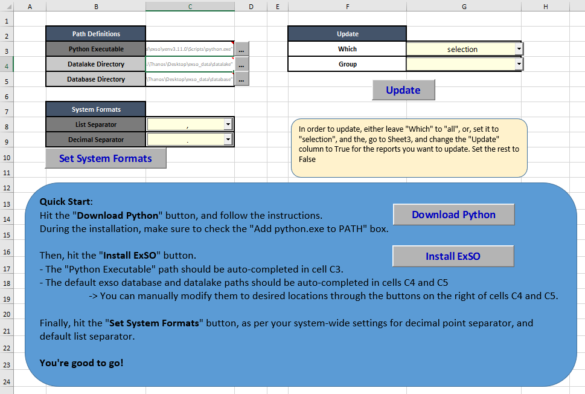

.. _installation:

*************
Installation
*************
.. include:: substitutions.rst

Installation / Upgrade to ExSO |version|
========================================
It's best to create a dedicated **virtual environment** to install and launch exso.

Auto-Mode
----------

Recommended for users:

* with zero to little programming skills,
* that are not familiar with virtual environments,
* that want to make a quick and effortless review of the tool.

.. _install_with_xlsm:
Process
""""""""

* Download `ExSO.xlsm <https://github.com/ThanosGkou/exso/blob/main/ExSO.xlsm>`_
* Follow the instructions contained inside. All it takes is two or three clicks
    * Hit the "Download Python" button and follow the instructions of the python installer
    * Hit the "Install ExSO" button.

   ExSO.xlsm user interface

* You can then continue using ExSO through |xlsm|, which provides an excel-based GUI for the exso API basic functionality
* Or, use the automatically created virtual environment through your preferred IDE, to directly use the exso API through the command line or an IDE.

Manual-Mode
------------
* Install Python >= 3.10
* Create a new virtual environment (Or, use an existing one if you know what you're doing)
* Install exso in this virtual environment:
>>> (venv) pip install exso

Important
----------
- ExSO comes with default formats:
    - List separator: ','
    - Decimal point: '.'
- If your system formats are different, declare it before starting using ExSO:
    - Through ExSO.xlsm (one click)
    - Through the Command-Line or the exso API (see :ref:`core_concepts` and :ref:`api` section)

Migration to ExSo |version|
----------------------------
- The Migration is as simple as the first-time installation.
- In case of a pre-existing database created with previous versions of ExSO, a newer version of ExSO may automatically delete (actually relocate to a local backup that will be previewed during execution) and rebuild some of the database files to ensure the smooth data migration.

