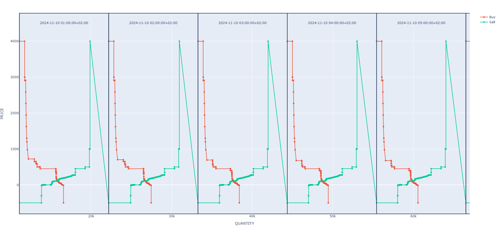

.. _whats_new:
.. include:: substitutions.rst

What's New
===========

Python
*******
- Support for Python >=3.10 (including 3.13.0)

Reports
********

* IPTO: ISP Results, ISP Unit Availabilities upgrade
* HEnEx:
    * Support for Intraday IDA Reports
    * Bug fix in XXX_Results (DAM, LIDA, CRIDA) when both Buy & Sell orders present from Renewables

Documentation
*************
- Dedicated documentation page in `Read the Docs <(https://exso.readthedocs.io/en/latest/)>`_

API
***

General Usage
"""""""""""""
* Provision of the |xlsm| high-level api, which is an excel-based GUI to install and use exso
* Reports Selection and Filtering:
    * More intuitive and powerful filtering
    * You can combine multiple filters to select which reports to include, which to exclude, from which publishers, and which groups, in an intersectional manner::

       exso.Updater(*args, which:str|list|None, exclude: str|list|None, publishers: str|list|None, groups: str|list|None)
* Report names are now, case insensitive:
    * e.g. DAM_Results = dam_ReSultS = dam_results
* Auto-propose similar report-names in case the inputted report name does not exist

DataBase Tree Access
""""""""""""""""""""""
* exso Database initialization made simpler::

    #old:
    tree = exso.Tree(*args).make_tree()

    #new:
    tree = exso.Tree(*args)

* "DNA" locators are case insensitive
    henex.DAM_Results.DAM_Results.Results = henex.dam_results.dam_results.results
* Support for shorter dna chains, if the report supports it:
    * If a file name is unique in the whole database, you can directly access it, without specifying the whole chain::

        tree['unique_file_name']

    * If a report has only a single file, you can access it quicker through the "fast forward" operator (">>")::

        tree['dam_results.>>']

* In case of entering an invalid DNA, the error message will auto-suggest most similar dna chains to the one you entered.
* Support for combining nodes::

    tree.combine((node1, node2, ..., nodeN), **kwargs)

* Support for non-exso csv files in the database
    * You can now use exso as an api for your own files!
    * Store your custom csv files :file:`exso_root_database/your_custom_folder_name`
    * access your files as normal exso.Nodes, and make transformations/visualizations
      ::
        tree = exso.Tree(root_base)
        tree['your_custom_folder_name.your_custom_file_paths'].plot(***kwargs)

DataBase Node Manipulation
"""""""""""""""""""""""""""
* .plot() and .export() methods of Node objects *to_path* argument can be either a directory or a file:
  If directory, the proper file names will be auto-created. If filepath, the given filepath will be used

* Added optional arguments in the Node.plot() method:
    * You can now enter a string for the chart’s title and ylabel
    * By default, a plot's title will be: <node.parent>.<node.name>

* Improved timezone handling input arguments:
    Now, all you need to do is leave the tz = None, or specify a string-timezone.
    ::
        #old
        node(start_date, end_date, tz_pipe = ['UTC', 'EET', 'None'])

        #new
        node(start_date, end_date, tz='EET', truncate_tz=True)

* :ref:`Plotting <node_plot_api>` enhancements:

    * Line or area chart, input argument simplification
::

        #old
        node.plot(*args, **kwargs, area=bool)

        #new
        node.plot(*args, **kwargs, kind = 'line'|'area')

    * node.plot allows for a transformation function input, to be applied prior to plotting

* Support for plotting demand-supply market bids:

